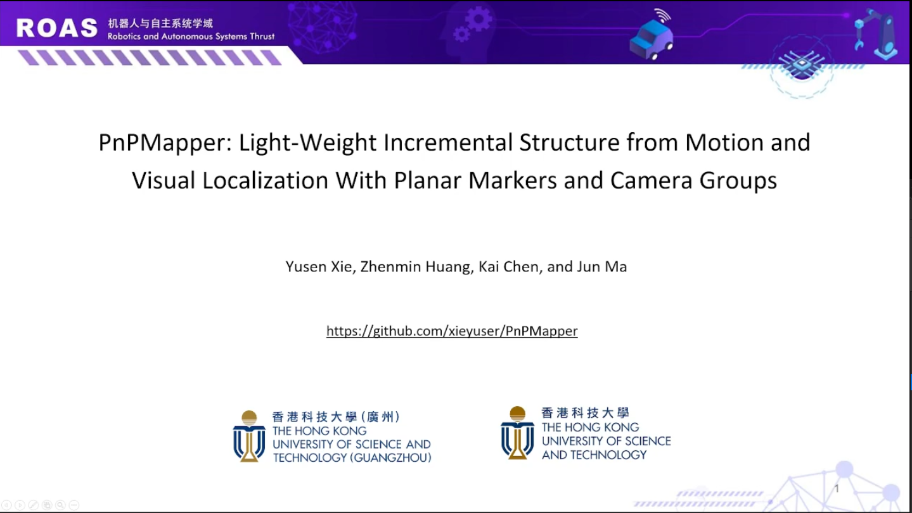

# PnPMapper
## Light-Weight Incremental Structure from Motion and Visual Localization With Planar Markers and Camera Groups

In our framework, the initial poses of markers and camera groups are calculated with **Perspective-n-Points (PnP)** in the front-end, while **bundle adjustment methods customized for markers and camera groups** are designed in the back-end to optimize the 6-DOF pose directly. 

Our algorithm facilitates the reconstruction of large scenes with **different marker sizes**, and its accuracy and speed of map building are shown to surpass existing methods. Our approach is suitable for a wide range of scenarios, including laboratories, basements, warehouses, and other industrial settings.

**15 Sep 2023**: Release *README.md*, some *results* and *datasets*, other code will be upload after the paper review.

[](https://youtu.be/j9Kne47aS_0?si=lgpc-zmrsZ-7cl_W)


## 1. Datasets and Algorithm results

### 1.1 Datasets Structure
We collect the public marker datasets from Degol and SPM-SLAM, and orignize these datasets like the following structure:
```
ece_floor4_wall/                      # scequence name 
├── calib.json                        # calibration parameters                                 
├── images                            # images collection
│   ├── 2017-11-22_19-45-24_933.jpeg
│   ├── 2017-11-22_19-45-27_368.jpeg
│   ├── 2017-11-22_19-45-29_604.jpeg
│   ├── 2017-11-22_19-45-31_872.jpeg
│   ├── ...
├── sfm.toml                          # configs of marker family and marker size
├── marker_gt.txt                     # ground truth of markers (optional in our datasets)
└── cam_gt.txt                        # ground truth of cameras (optional in our datasets)
```

The key-value demo of *sfm.toml*
``` toml
[marker]
# marker type, we support three types: 
# 0:ARUCO_4X4_1000
# 1:ARUCO_ORIGINAL 
# 2:APRILTAG
# which is defined in CMakeLists.txt.
type = 'aruco'             
family = '4x4_1000'

# meters
# the size of every marker in the environment, it is need to be defined as prior information.
# the function processing the marker size is [parse_size_json] in *python/play_bag.py and python/play_bag_mono.py*
board_size = [
        [
			0.3,
			0.25,
			0.35
        ], 
        [
            ['default'],
            ['100-199'],
            ['200-299']
        ]
    ]

```
### 1.2 Download
Download the abovementioned datasets from [Google Drive](https://drive.google.com/drive/folders/12OZqnK7coeO3TWUvuPSzBPKCZAaX2vnV?usp=sharing).

### 1.3 Public Datasets
The perfermence in Degol's work are stored in *./doc/public*.

<!-- 
 -->


### 1.4 Proposed Marker Datasets of Same Size
The perfermence in Degol's work are stored in *./doc/same-size*.


<!--  -->

### 1.5 Proposed Marker Datasets of Different Size

The perfermence in Degol's work are stored in *./doc/diff-size*.


<!--  -->


## 2. Prerequisites
2.1 Ubuntu and ROS. 

We build this repo by [RoboStack](https://robostack.github.io/). You can install different ROS distributions in **Conda Environment** via [RoboStack Installation](https://robostack.github.io/). Source code has been tested in **ROS Kinect**, **ROS Melodic** and **ROS Noetic**.

2.2 Some packages can be installed by:
``` Bash
    conda(mamba) install --file conda_pkgs.txt
```


## 3. Build and Source
Clone the repository and catkin_make:
``` Bash
    # build
    mkdir -p ~/catkin_ws/src
    git clone https://github.com/xieyuser/PnPMapper.git
    cd ../
    catkin_make   # change some DEFINITIONS


    # source
    # temporary
    source ~/catkin_ws/devel/setup.bash

    # start with conda activate
    echo "source ~/catkin_ws/devel/setup.bash" >> ~/miniconda3/envs/{ENV_NAME}/setup.sh
```

**Note:** There are some ***DEFINITIONS*** in *CMakeLists.txt*, please be careful to build if you want to run on specific dataset.

***DEFINITIONS***

``` Cmake
# -DIS_MULTI=1: use multi camera code
# -DIS_MULTI=0: use mono camera code
add_definitions(-DIS_MULTI=1)

# marker type
# 0: ARUCO_4X4_1000
# 1: ARUCO_ORIGINAL
# 2: APRILTAG
add_definitions(-DENCODE=0)

# whether the robust huber kernel is used
# 0: no
# 1: used
add_definitions(-DROBUST=1)

# data source
# 0: from image collections
# 1: from rosbag
add_definitions(-DFROM_ROSBAG=0)
```

## 4. How to use
Please check all parameters in *configs*. Sometimes the false parameters are main reason why SfM procedure is crashed (e.g. input inverse transfrom matrix in extrinsics of camera groups.). 
### 4.1. Mapping
*Monocular:*

``` bash
CHECK your CMakeLists.txt

# collect images and publish them via ROS, this commmand should be  call firstly because this script need to parse marker size in sfm.toml and write this size information to ./configs/env_ids.json

python/play_bag_mono.py $DATA_ROOT
# e.g. python/play_bag.py ~/Desktop/data/dataset-release/eccv/cee_day/

# start mapping service
roslaunch pnpmapper  buildmap.launch
```

*Multiple Cameras:*

<ol>
<li>CMakeLists.txt</li>

``` bash
CHECK your CMakeLists.txt and Build
```
<li>

Calculate extrinsics of cameras, in our dataset, we use TWO different setups for cameras, you can use the following script to calculate. 

``` bash
python python/calc_extrinsics.py
```

Maybe you want to calibrate it by other repos (e.g. [Kalibr](https://github.com/ethz-asl/kalibr.git))

$$T^{F^i} = T_{g} \cdot T^{F^i}_{g}$$

in *[configs_build.yaml](configs/config_buildmap.yaml)* and *[config_localization.yaml](configs/config_localization.yaml)*

$$extrinsicsT\{i\}g = T^{F^{i}}_{g}$$

</li>
Collect images and publish them via ROS, this commmand should be  call firstly because this script need to parse marker size in sfm.toml and write this size information to ./configs/env_ids.json

``` bash
python/play_bag.py $DATA_ROOT
# e.g. python/play_bag.py ~/Desktop/data/dataset-release/ours/dataset-indoor2-120-same/

# start mapping service
roslaunch pnpmapper buildmap.launch
```
</ol>

### 4.2. Save Map and Visualization
``` bash
# save map
rosservice call /save_map "destination: $PATH"
(e.g. rosservice call /save_map "destination: /home/xieys/optimized_map.json")

# visualization
python python/open3d_showmap.py ~/optimized_map.json
```


### 4.3. Localization
After reconstruct the global marker map, we can get a single file (as is mentioned above *~/optimized_map.json*), which can be used for global visual localization. Localization result can be subscribe in 
*odom0InfoTopic*, which can be difined in *[config_localization.yaml](configs/config_localization.yaml)*.
The procedure is mostly same as <u>**4.1 Mapping**</u>

<ol>
<li>modify marker map file (or you can predefine you own marker map by accurate measurement, same structure is needed)
</li>

``` bash
cp ~/optimized_map.json configs/map.json
```
<li>
start localization node

``` bash
roslaunch pnpmapper localization.launch
```
</li>

<li>publish image/images</li>

``` bash
python/play_bag.py $DATA_ROOT
# e.g. python/play_bag.py ~/Desktop/data/dataset-release/ours/dataset-indoor2-120-same/
```

</ol>


### 4.4. Evaluate
We can evaluate the ATE via these two scripts

``` bash
# marker
./scripts/evo_marker.sh $DATA_ROOT

# camera
./scripts/evo_camera.sh $DATA_ROOT
```

## 5. License
The source code is released under [MIT](https://mit-license.org/) license.

We are still working on improving this repository.
